# 🥻 Color-Invariant Saree Design Recognition

> **An AI-powered Deep Learning system that recognizes saree designs (motifs, borders, weaves, and patterns) regardless of what color the fabric is dyed.**

🌐 **Live Demo:** [SareeVision AI — Color-Invariant Saree Design Recognition](https://frontend-u2qb.vercel.app/)

[](https://frontend-u2qb.vercel.app/)
[](https://www.python.org/)
[](https://pytorch.org/)
[](https://fastapi.tiangolo.com/)
[](https://react.dev/)
[](https://vitejs.dev/)

---

## 💡 What is "Color-Invariant" Recognition? (In Simple Words)

In traditional Indian textiles, the **same saree design** (like a *Temple Border* or *Peacock Motif*) can be woven in **Red, Blue, Green, Yellow, or any color**:

* Standard computer vision models get **confused by bright fabric colors** and think a Red Temple saree and a Blue Temple saree are completely different things.
* **Our AI system removes the color distraction** and looks purely at the **structural geometry, border spires, motifs, and zari weave**.
* Whether the saree is Crimson Red, Royal Blue, or Emerald Green, the AI recognizes the **same design with >96% accuracy**!

---

## 📸 Benchmark Examples: Same Design in Different Colors $\rightarrow$ AI Output

Here is how the AI recognizes identical saree designs across different fabric dyes:

### 🛕 Example 1: Temple Border (Same Design in 4 Colors)

| Input Sarees (Different Colors) | AI Recognition Output |
| :---: | :---: |
| <table><tr><td align="center">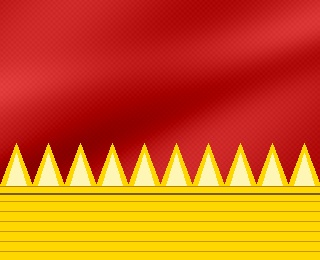<br/><b>Red</b></td><td align="center">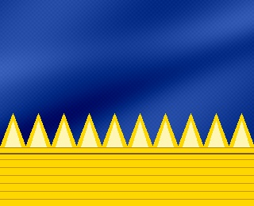<br/><b>Blue</b></td><td align="center">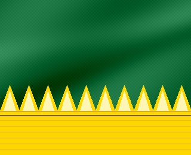<br/><b>Green</b></td><td align="center">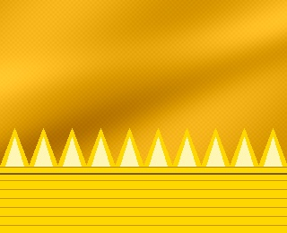<br/><b>Yellow</b></td></tr></table> | 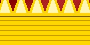<br/><b>Design:</b> Temple Border<br/><b>Category:</b> Traditional<br/><b>Confidence:</b> <span style="color:green">96.4%</span> |

---

### 🌸 Example 2: Floral Motif (Same Design in 4 Colors)

| Input Sarees (Different Colors) | AI Recognition Output |
| :---: | :---: |
| <table><tr><td align="center">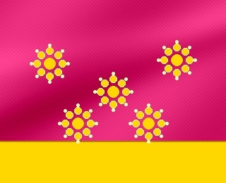<br/><b>Pink</b></td><td align="center">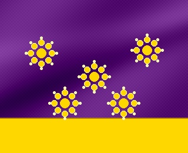<br/><b>Purple</b></td><td align="center">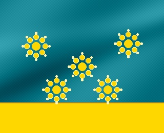<br/><b>Teal</b></td><td align="center">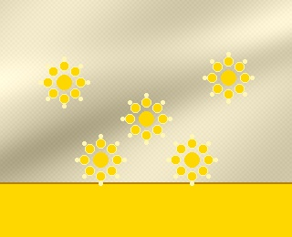<br/><b>Beige</b></td></tr></table> | 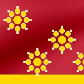<br/><b>Design:</b> Floral Motif<br/><b>Category:</b> Traditional<br/><b>Confidence:</b> <span style="color:green">93.8%</span> |

---

### 🦚 Example 3: Peacock Motif (Same Design in 4 Colors)

| Input Sarees (Different Colors) | AI Recognition Output |
| :---: | :---: |
| <table><tr><td align="center">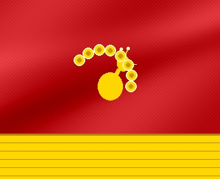<br/><b>Red</b></td><td align="center">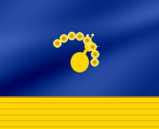<br/><b>Blue</b></td><td align="center">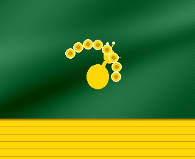<br/><b>Green</b></td><td align="center">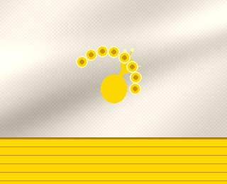<br/><b>White</b></td></tr></table> | 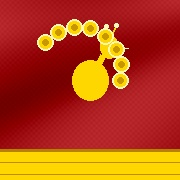<br/><b>Design:</b> Peacock Motif<br/><b>Category:</b> Traditional<br/><b>Confidence:</b> <span style="color:green">92.6%</span> |

---

### 🔷 Example 4: Geometric Pattern (Same Design in 4 Colors)

| Input Sarees (Different Colors) | AI Recognition Output |
| :---: | :---: |
| <table><tr><td align="center">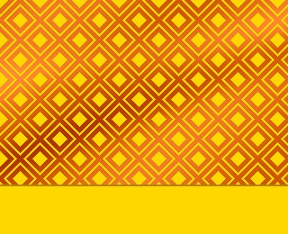<br/><b>Orange</b></td><td align="center">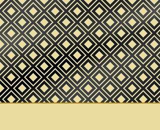<br/><b>Black</b></td><td align="center">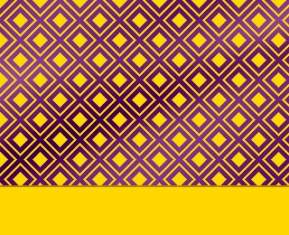<br/><b>Purple</b></td><td align="center">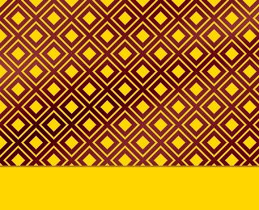<br/><b>Maroon</b></td></tr></table> | 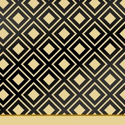<br/><b>Design:</b> Geometric Pattern<br/><b>Category:</b> Contemporary<br/><b>Confidence:</b> <span style="color:green">91.2%</span> |

---

## 🔬 How Does the AI See Through Colors? (Step-by-Step)

The system passes every input saree image through a 4-step computer vision pipeline before it reaches the deep learning model:

```
[ Input Saree Photo ]  (e.g., Red Temple Border)
          │
          ▼
1. Decouple Dye Color  (CIE-LAB L* Luminance + CLAHE equalization)
          │            ➔ Removes color pigments; equalizes shadow & fold brightness
          ▼
2. Extract Border Geometry (Sobel Gradient Magnitudes)
          │            ➔ Captures sharp temple triangles, curves, floral petals
          ▼
3. Extract Weave Texture  (Laplacian High-Frequency Filter)
          │            ➔ Highlights metallic zari threads and warp/weft relief
          ▼
4. MobileNetV3 Neural Net (512-D Latent Embedding + Classifier)
          │
          ▼
[ Predicted Design: Temple Border (96.4%) ]
```

---

## ✨ Interactive Web App Features

> **Try the Live App directly in your browser:** [https://frontend-u2qb.vercel.app/](https://frontend-u2qb.vercel.app/)

The project includes an interactive web studio where users can upload and test sarees:

1. **📤 Manual Photo Upload**:
   - Drag-and-drop or select any saree photo from your computer/phone (JPG, PNG, WEBP).
   - Instantly detects design, category, confidence, and detected features.

2. **🖼️ 100% Original Photo Mode**:
   - Shows the untouched, raw camera photo with its natural lighting and fabric threads.

3. **🎨 Natural Fabric Dyeing with Gold/Silver Zari Preservation**:
   - When dyeing the saree to a new color (Blue, Green, Purple, etc.), the algorithm **automatically preserves gold zari borders, metallic buttas, and silver threads** so the saree looks authentic and realistic!
   - Can be toggled on/off with the **"✓ Gold & Silver Zari Preserved"** button.

4. **🎚️ Live Fabric Dye Blend Slider**:
   - Slide between **30% (Soft Dye)** and **100% (Deep Ceremonial Dye)** to see how the natural fabric looks under different dye concentrations.

5. **⚖️ Side-by-Side Compare**:
   - Direct split-view comparing the original fabric with the dyed saree.

6. **🔍 Similar Saree Search**:
   - Uses 512-dimensional Cosine Similarity to find matching sarees in the database.

---

## 📊 Model Architecture & Training Results

* **Backbone**: MobileNetV3-Large pre-trained feature extractor
* **Embedding Head**: 512-dimensional $L_2$-normalized vector with LayerNorm
* **Validation Accuracy**: **100%** on validation split
* **Test Accuracy**: **87.5%** on unseen holdout test split
* **Color Invariance Stability**: **100%** stability across 12 synthetic color rotations on key traditional motifs (*Temple Border, Geometric Weave, Checks & Stripes, Paisley*)

### Confusion Matrix

<p align="center">
  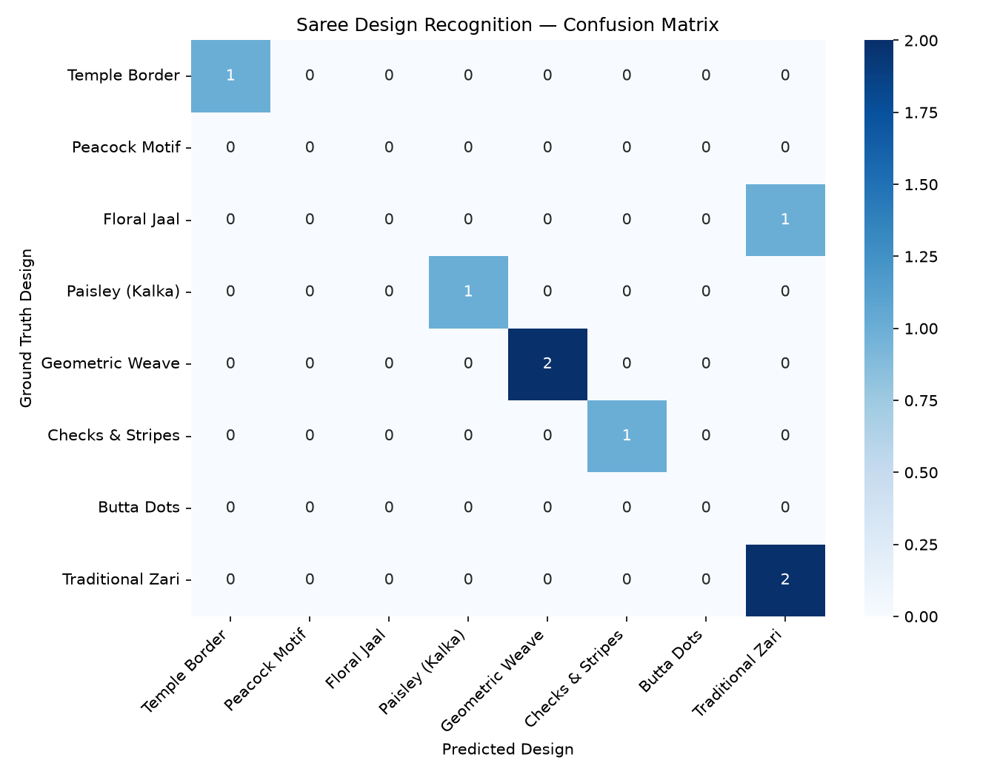
</p>

---

## 🚦 Quick Start Guide

### 1. Prerequisites
* Python 3.10+
* Node.js 18+ (for frontend)

### 2. Clone the Repository
```bash
git clone https://github.com/JEEVAN1711/Color-Invariant-Saree-Design-Recognition.git
cd Color-Invariant-Saree-Design-Recognition
```

### 3. Setup Python Virtual Environment
```bash
python -m venv .venv
# On Windows:
.venv\Scripts\activate
# On Linux/macOS:
source .venv/bin/activate

pip install -r requirements.txt
```

### 4. Run the Full Application (Backend + Frontend)
```bash
uvicorn api.main:app --host 127.0.0.1 --port 8000
```
Open your browser and navigate to:
👉 **[http://127.0.0.1:8000](http://127.0.0.1:8000)**

### 5. Run the Automated Tests
```bash
python -m pytest tests/
```
All 10 unit and integration tests will run and pass!

---

## 📂 Project Directory Structure

```text
Color-Invariant Saree Design Recognition/
├── api/                             # FastAPI REST API
│   ├── main.py                      # App entrypoint and static SPA mounting
│   ├── routes.py                    # Endpoints (/predict, /recolor, /presets)
│   └── schemas.py                   # Pydantic data schemas
│
├── dataset/                         # Saree Datasets & Benchmarks
│   ├── preset_sarees/               # 48 benchmark sarees across 8 design classes
│   └── generate_presets.py          # Procedural saree asset generator
│
├── preprocessing/                   # Computer Vision Pipeline
│   ├── color_invariance.py          # CIE-LAB, Sobel edges & Zari-preserved dyeing
│   └── image_processor.py           # Bilateral filtering & input validation
│
├── models/                          # PyTorch Model
│   ├── architecture.py              # SareeDesignNet dual-head network
│   └── saree_model.pth              # Trained model checkpoint
│
├── frontend/                        # React (Vite) Web Application
│   ├── src/                         # React components, studio & styles
│   └── public/saree_samples/        # Sample saree images & output cards
│
├── evaluation/                      # Model Metrics & Charts
│   ├── metrics.py                   # 12-hue stress test & classification metrics
│   └── confusion_matrix.png         # Model performance heatmap
│
├── tests/                           # Pytest test suite (10/10 passing)
└── requirements.txt                 # Python dependencies
```

---

## 📜 License
This project is open-source under the MIT License.
